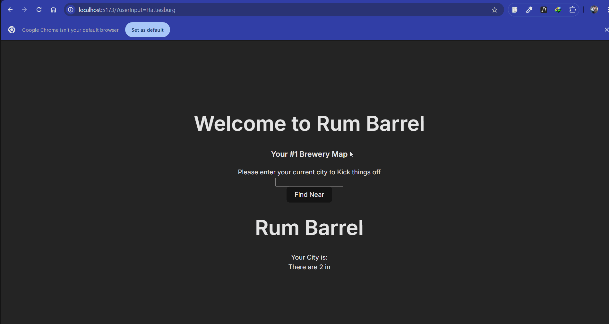

# **Rum Barrel v2: A Brewery Locator App**

**Rum Barrel** (v2) is a web application that helps users discover breweries in a specified location, providing detailed information and a **new** visual analysis of the data.

**Key Features:**
- _Brewery Search_: Users can enter a location to find a list of breweries.
- _Detail Pages_: Clicking on a brewery reveals more information on a dedicated page.
- _Unique Chart_: A bar chart provides insights based on the fetched data.
- _Direct Links_: Each brewery has a unique URL for easy sharing and navigation.
- _Sidebar View_: Ensures visibility while browsing details.

## Video Walkthrough

<!-- Replace this with whatever GIF tool you used! -->
GIF created with LiceCap  
<!-- Recommended tools:
[Kap](https://getkap.co/) for macOS
[ScreenToGif](https://www.screentogif.com/) for Windows
[peek](https://github.com/phw/peek) for Linux. -->

## Notes

Describe any challenges encountered while building the app.
Couldn't implement the specific bounds stretch feature

## License

    Copyright [2024] [name of copyright owner]

    Licensed under the Apache License, Version 2.0 (the "License");
    you may not use this file except in compliance with the License.
    You may obtain a copy of the License at

        http://www.apache.org/licenses/LICENSE-2.0

    Unless required by applicable law or agreed to in writing, software
    distributed under the License is distributed on an "AS IS" BASIS,
    WITHOUT WARRANTIES OR CONDITIONS OF ANY KIND, either express or implied.
    See the License for the specific language governing permissions and
    limitations under the License.
